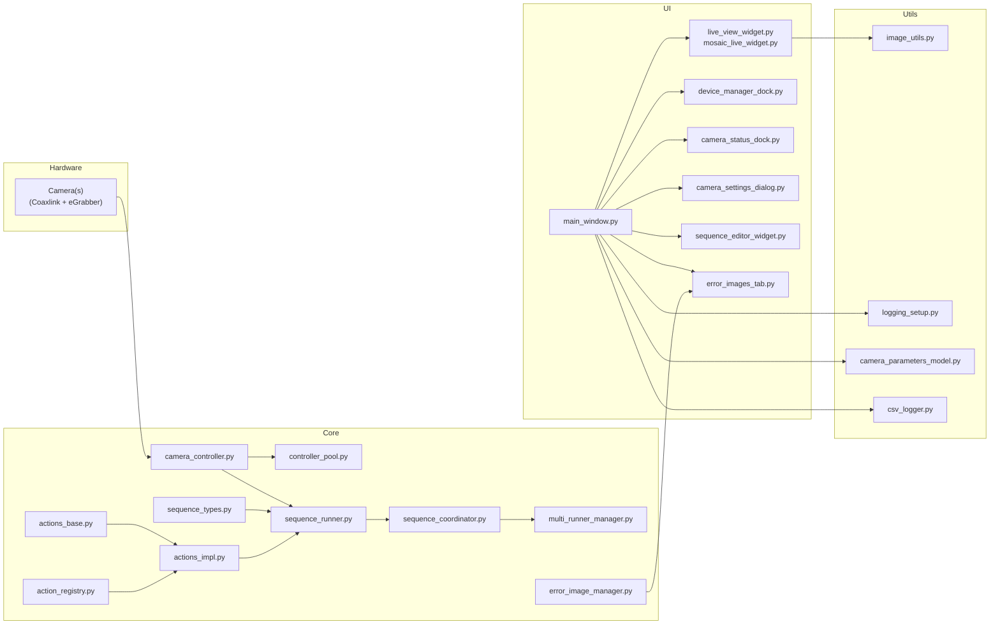

# ViewTS – Vieworks Test Suite

ViewTS is a PyQt5-based **camera test and validation suite** for Vieworks cameras using
Euresys Coaxlink + eGrabber. It provides a reproducible sequence engine, rich GUI, and
various utilities for camera bring-up, regression testing, and reliability verification.

Key ideas:

- Multi-camera support via a centralized controller pool
- JSON-based test sequences (start/stop, parameter sweeps, reliability scenarios)
- Real-time tiled live view with automatic down-scaling in a background worker
- Error-image capture and archiving
- Extensible action system (`actions_base.py` / `actions_impl.py` / `action_registry.py`)


---

## Features

### Camera + System Initialization

- Robust launcher (`main.py`) that:
  - Sets up environment variables and plugin paths
  - Initializes logging
  - Initializes hardware via `src.core.initializer`
  - Starts the Qt event loop with `MainWindow`

- Hardware initialization (`src/core/initializer.py`)
  - Discovers and connects cameras through `CameraController`
  - Registers controllers in a global `controller_pool`
  - Logs the number of connected cameras and reports fatal errors if initialization fails

### Action & Sequence Engine

- **Action definitions**

  - `src/core/actions_base.py`: base types (`ActionDefinition`, `ActionArgument`,
    `ActionResult`, etc.)
  - `src/core/action_registry.py`: central registry for all actions, mapping action IDs
    (e.g. `"connect_camera"`, `"set_parameter"`) to metadata

- **Action implementations**

  - `src/core/actions_impl.py`: `execute_*` functions for:
    - Connecting/disconnecting cameras
    - Changing GenICam features (exposure, gain, link count, trigger mode, etc.)
    - Grabbing frames, checking link status, asserting feature values
    - Monitoring frame loss (`FrameLossMonitor`)

- **Sequence types & coordinator**

  - `src/core/sequence_types.py`: dataclasses for `SequenceStep`, `Sequence`, loop
    constructs, error policies (`continue_on_fail`, etc.), and JSON
    (de-)serialization helpers
  - `src/core/sequence_runner.py` and `src/core/sequence_coordinator.py`: run sequences,
    handle branching/looping, and orchestrate actions and context
  - `src/core/multi_runner_manager.py`: manages multiple running sequences

- **Backtest examples**

  - `src/backtest/*.py` and `src/backtest/*.json`: ready-made sequences for
    - link-trigger tests
    - multi-frame acquisition and stop tests
    - brightness sweep tests
    - reliability / long-run sequences for specific camera models

### GUI

The GUI lives in `src/ui` and is built on **PyQt5**.

- **Main window**

  - `src/ui/main_window.py`
  - Central hub that wires together docks and tabs:
    - Device manager dock
    - Camera status dock
    - Sequence editor
    - Error image tab
    - Mosaic or single-camera live view

- **Live view & grabbing**

  - `src/ui/grab_worker.py`
    - Background `QThread` that drains frames from one or more cameras
    - Uses a fast down-scaling path (via NumPy + optional `cv2.resize`) to deliver
      ready-to-paint `QImage` objects
  - `src/ui/live_view_widget.py` and `src/ui/mosaic_live_widget.py`
    - Display live tiles, handle resize events, and forward new target widths back
      to `GrabWorker`

- **Camera controls and status**

  - `src/ui/camera_settings_dialog.py`: popup dialog to control camera parameters
  - `src/ui/camera_status_dock.py`: per-camera status (link status, FPS, error counters)
  - `src/ui/device_manager_dock.py`: list of connected devices and connect/disconnect actions

- **Sequences & error images**

  - `src/ui/sequence_editor_widget.py`: UI for editing and running JSON-based sequences
  - `src/ui/error_images_tab.py`: shows error frames captured by `error_image_manager.py`
    for quick inspection

### Utilities

Residing in `src/utils`:

- `logging_setup.py` – initializes the logging system (console + file handlers)
- `image_utils.py` – image helpers:
  - `fast_resize()`, `make_thumbnail()`
  - `save_frame()` / `archive_error_image()` (automatic BMP, robust fallback)
  - `compare_frames_advanced()` and `is_scrambled_image()` using SSIM
  - `calculate_stats()`
- `camera_parameters_model.py`
  - Loads camera XML files and builds a parameter map
  - Provides helpers to list parameter names and possible values
- `csv_logger.py`
  - Structured CSV logging for measurement results or regression logs
- `memento_recorder.py`
  - Integration point for Euresys Memento logging
- `sandbox.py`
  - Experimental scripts and scratchpad utilities

---

## Project Structure

```text
ViewTS/
└─ ViewTS-main/
   ├─ main.py                 # Application launcher
   ├─ vieworks.ico            # Windows icon
   └─ src/
      ├─ backtest/            # Example/test sequences (JSON + helper scripts)
      ├─ core/                # Core engine: actions, sequences, controllers
      │  ├─ camera_controller.py
      │  ├─ controller_pool.py
      │  ├─ action_registry.py
      │  ├─ actions_base.py
      │  ├─ actions_impl.py
      │  ├─ sequence_types.py
      │  ├─ sequence_runner.py
      │  ├─ sequence_coordinator.py
      │  ├─ multi_runner_manager.py
      │  ├─ error_image_manager.py
      │  ├─ events.py
      │  ├─ initializer.py
      │  └─ logging_config.py
      ├─ ui/                  # PyQt5 widgets & windows
      │  ├─ main_window.py
      │  ├─ grab_worker.py
      │  ├─ live_view_widget.py
      │  ├─ mosaic_live_widget.py
      │  ├─ camera_settings_dialog.py
      │  ├─ camera_status_dock.py
      │  ├─ device_manager_dock.py
      │  ├─ sequence_editor_widget.py
      │  ├─ error_images_tab.py
      │  └─ run_safe.py
      └─ utils/               # Helper modules
         ├─ image_utils.py
         ├─ logging_setup.py
         ├─ camera_parameters_model.py
         ├─ csv_logger.py
         ├─ memento_recorder.py
         └─ sandbox.py
```

---

## Architecture Diagram (Mermaid)



---

## Dependencies

From the source code under `src/`, the project relies on the following external libraries:

- `PyQt5` – GUI (Qt Widgets, Core, Gui)
- `numpy` – frame buffers and numeric work
- `opencv-python` (`cv2`) – fast resizing and image conversions for thumbnails/live view
- `scikit-image` – SSIM-based comparison (`skimage.metrics.structural_similarity`)
- `egrabber` – Euresys Coaxlink / eGrabber camera SDK (Python bindings)
- `GenApi` – GenICam / eGrabber related; typically installed with the vendor SDK, not via `pip`

Based on the environment information you shared earlier, a concrete `requirements.txt` can be:

```text
PyQt5==5.15.11
numpy==1.24.4
opencv-python==4.11.0.86
scikit-image==0.21.0
egrabber==25.3.2.80
```

> Note  
> - `GenApi` is usually provided as part of the camera SDK installation and is **not**
>   normally installed via `pip`, so it is not listed in `requirements.txt`.
> - `PyQt5-Qt5` and `PyQt5_sip` are pulled in automatically with `PyQt5`.

---

## Installation

```bash
pip install -r requirements.txt
```

Hardware SDK and drivers:

- Install Euresys Coaxlink drivers and eGrabber SDK (including Python bindings).
- Make sure the GenICam/GenApi components shipped with the SDK are visible on the system path.

---

## Running ViewTS

From the `ViewTS-main` directory:

```bash
python main.py
```

On Windows you may also package the application using PyInstaller; the launcher
is designed to cope with PyInstaller’s runtime directory (for icons, plugins, etc.)
if you mirror the structure used in the original project.

---

## Notes

- Without a physical camera and proper SDK installation, the application may fall
  back to a limited or dummy mode for some operations.
- To run real reliability tests and long sequences, you should:
  - Connect the appropriate Vieworks cameras
  - Configure Coaxlink/eGrabber properly
  - Adjust the JSON sequences under `src/backtest/` or create your own via the
    sequence editor.
